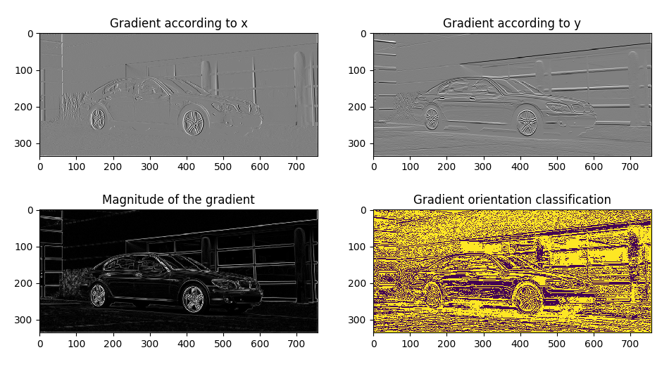

# Histogram Of Oriented Gradients (HOG)

HOG method is a computation technique for object recognition and edge detection. This method has been proposed by N. Dalal and B. Triggs in their research paper - "Histograms of Oriented Gradients for Human Detection, CVPR, 2005". The method has been first experimented for human detection and has the reputation of achieving up to 98 % accuracy for human detection.

## Computation

### Principle

The human detection is done by comparing the unknow object image with images of humans. The comparison is done with a choosen metric (see Metrics below) that compares HOG representation of both images. 

### HOG representation

#### Gradient orientation

For HOG representation Gradient orientation value is needed for every pixel. The Gradient orientation is given by : orientation = arctan(Iy/Ix) where Iy is the gradient according to y (obtained by convolving image with the 1D kernel [-1 0 1]T) and Ix is the gradient ccording to x (obtained by convolving image with the kernel [-1 0 1]). To get a ‘signed’ gradient we will need to translate the range of the gradient from [-180, 180] to [0, 360] degrees.

#### Histogram computation

To get HOG representation an image should be divided in cells. The size of the cells directly impacts the accuracy of the prediction and the computation cost. The histogram is then calculated over the gradient orientation obtained before for each cell.

## Examples

### HOG computation

  
  
Image on wich HOG will be computed

  
  
Result of gradient orientation computation (On 4th figure all pixels with gradient
orientation in [0,180] are in yellow and those in [180,360] are in blue)

  
  
30x30 pixels grid

  
  
Histogram of Orientation Gradients

### Human detection

Human detection with HOG is performed by computing *similarity* between an unknow image and a human image.
Bellow are the similarities computed for the following objects. The metric used for similarity computation is here the *cosine similarity* wich is equal, for two vector A and B, to A.B / ||A||.||B||

  
  
Similarity: 0.6

  
  
Similarity: 0.4

